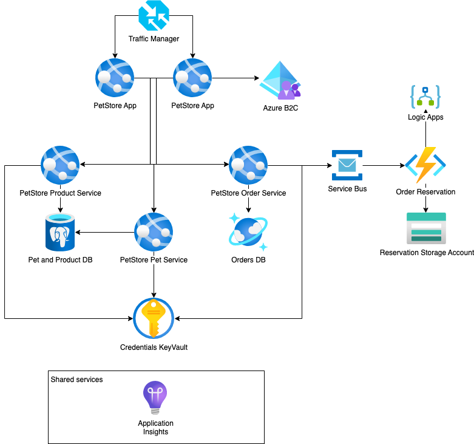

# **Azure Cost control**
Cost planning is important for effective budget management, cost optimization, decision-making, resource allocation, cost control, and supporting scalability and growth. By proactively planning and managing costs, organizations can optimize their Azure investments, achieve financial transparency, and drive overall business success.

The Azure Pricing Calculator is a web-based tool provided by Microsoft that allows you to estimate the cost of using Azure services and build customized cost estimates for your specific requirements.

<https://azure.microsoft.com/pricing/calculator>

In this chapter we will create a cost estimate for the PetStore project.
# **1. Azure Pricing Calculator**
Building an estimate in the Azure Pricing Calculator involves selecting the desired Azure services, configuring their parameters, and adjusting various options to create a customized cost estimate.
## **1.1. Selecting the Azure Services**
Upon accessing the Azure Pricing Calculator, you will find a wide range of Azure services listed.

Browse through the available services or use the search functionality to find the specific services you want to include in your estimate.

Click on each service to add it to your estimate.

In the final assignment of CloudX Java developer we have the following PetStore reference architecture:

For PetStore we need to account costs for the following services:

- Container Regitry
- App Services
- Traffic Manager
- Azure Functions
- Storage Account
- Azure Monitor
- Azure Database for PostgreSQL
- Azure Cosmos DB
- Azure Key Vault
- Azure Service Bus

You can find an example of PetStore project price calculation [here](https://azure.com/e/1400855649774a0ab267c8e7c1a86603) 
## **1.2. Configuring the Services**
Once you have added the desired services to your estimate, you can configure them based on your requirements.

Each service will have different configuration options, such as the number of instances, storage capacity, data transfer, and other relevant settings.

Depending on the service, you may need to specify parameters like region, instance size, storage type, networking options, and more.
## **1.3. Adjusting Parameters**
The Azure Pricing Calculator provides various parameters that allow you to fine-tune your cost estimate.

These parameters may include region selection, usage patterns, duration, and other factors that affect the cost of the selected services.

Pay attention to the impact of each parameter on the cost estimate and make adjustments accordingly.

It's important to note that the Azure Pricing Calculator provides real-time pricing information, so you can experiment with different configurations and options to get an accurate estimate of your Azure costs before actually provisioning the services. This helps you make informed decisions and plan your budget accordingly.
## **1.4. Saving costs**
Saving costs in Azure involves implementing various strategies and best practices to optimize resource utilization, take advantage of cost-saving features, and minimize unnecessary expenditures. Here are some effective ways to save costs in Azure:

- Right-size Resources: Continuously monitor and adjust the size of your Azure resources to match your workload requirements. Downsizing or scaling resources based on actual usage helps avoid overprovisioning and reduces costs.
- Use Azure Reserved Instances: Azure Reserved Instances offer significant cost savings for long-term usage commitments.
- Leverage Azure Hybrid Benefit: If you have on-premises licenses, Azure Hybrid Benefit allows you to apply these licenses to corresponding Azure services, such as Windows Server or SQL Server. This benefit enables you to save costs by paying only the reduced Azure infrastructure rate instead of full license fees.
- Optimize Storage Costs: Utilize Azure Blob Storage's tiering capabilities to automatically move data to the most cost-effective storage tier based on access patterns.
- Implement Autoscaling: Configure autoscaling for your Azure resources to automatically adjust capacity based on demand. Autoscaling ensures that you have the right amount of resources available when needed, preventing overprovisioning during periods of low utilization.
- Schedule Resources: For non-production environments, schedule the shutdown of virtual machines, databases, and other resources during off-peak hours or weekends when they are not required. This practice can significantly reduce costs by eliminating unnecessary compute and storage charges.
- Utilize Azure Cost Management: Leverage the capabilities of Azure Cost Management to gain visibility into your Azure spending. Set budget alerts to be notified when costs exceed predefined thresholds and utilize cost optimization recommendations to identify areas where cost savings can be achieved.
- Use Spot Virtual Machines: Consider using Azure Spot Virtual Machines for workloads that can tolerate interruptions. Spot Virtual Machines offer significantly lower costs compared to regular pay-as-you-go instances, enabling you to run cost-effective batch processing or non-critical workloads.
- Monitor and Optimize Data Transfer: Be mindful of data transfer costs between Azure regions, especially if you have geographically distributed deployments. Optimize data transfer by leveraging Azure Content Delivery Network (CDN) or Azure ExpressRoute to minimize transfer fees.

Remember, cost optimization is an ongoing process. Regularly review your Azure resources, monitor usage patterns, and identify opportunities for optimization. By implementing these cost-saving strategies and continuously optimizing your Azure deployment, you can achieve significant cost savings without compromising performance or functionality.
# **2. Total Cost of Ownership (TCO) Calculator**
The Total Cost of Ownership (TCO) Calculator and the Azure Pricing Calculator are two distinct tools provided by Microsoft to help organizations estimate and understand the costs associated with using Azure services.

While both tools assist in estimating costs, the key difference lies in their scope and focus. The TCO Calculator provides a holistic view of the costs associated with running workloads on-premises versus in Azure, taking into account various factors beyond just Azure service pricing. On the other hand, the Azure Pricing Calculator focuses specifically on estimating the costs of utilizing Azure services and provides more granular details on Azure resource pricing and configurations.
# **3. Tasks**
1. Create your own estimate for the PetStore project.
   Consider the store has a total of about 10K pet's products and they estimated they will be receiving 1K orders / month initially. 
   Check your estimation with one provided [here](https://azure.com/e/1400855649774a0ab267c8e7c1a86603) 
1. Consider also the cost for the development and test environments. Be aware that price can change when switching to Dev/Test plan.
1. Check how the monthly price can change when using different regions for the services.
1. Check the discounts you can achieve by changing commitment: in case database and storage instances are reserved for an extended period on time.
1. Another sample estimation for the ReportPortal project with AKS [here](https://azure.com/e/8649e5924d9846a09ed39157fad5da69) 

