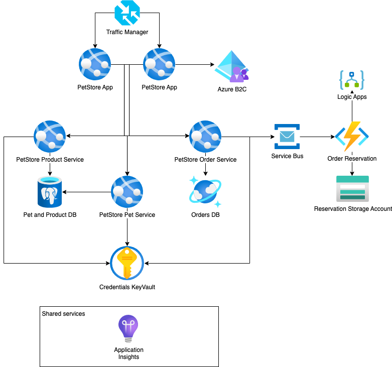

# Module 10: Final Assignment
## Home task
*Please, complete the following task:*

During the course the PetStore application was developed piece by piece.

For the final task you need to implement these pieces into one solution according to the diagram below and the next points have to be covered:

1. PetStore Web Apps are balanced with Traffic Manager
2. PetStore Web Apps should be available for auto-scaling
3. PetStore Web Apps should support deployment slots (at least one instance of Web)
4. Pet and Product Services should use Azure SQL as a database
5. Order Service should use Cosmos DB as a database
6. Order Items Reserver function should be able to create Reservation JSON files in Azure Blob Storage by communicating through Service Bus and handle errors by sending the email through Logic Apps.
7. PetStore Web App is protected by Azure B2C for authentication

### Definition of Done

1. All points above are implemented
2. Following evidences are shared:
   - Link to a public git repository with updated Pet Store solution
   - Screenshot of the list of Azure resources that reflect the diagram above
   - Screenshot of Azure Storage JSON result produced by Order Items Reserver Function
   - Screenshot of Order object in CosmosDB
   - Screenshot of the Azure B2C configuration

### Check the task of your peer
1. Please check in Teams channel (Files tab) information regarding the person whose home task you need to check.
2. Organize a meeting together with your peer.
3. During this meeting with your peer share the solution with each other.
4. Assess how your peer did the task using the Definition of Done criteria, specified above.
5. Go to Learn.epam.com - Contribution tab - Mentorship - Expert View.
6. Find CloudX Associate program and find the person, whose task you already checked.
7. Put a mark for the task.

## Clean up:
Resources left running can cost you money. You can delete resources individually or delete the resource group to delete the entire set of resources.
### Definition of done:
- Resources are deleted

