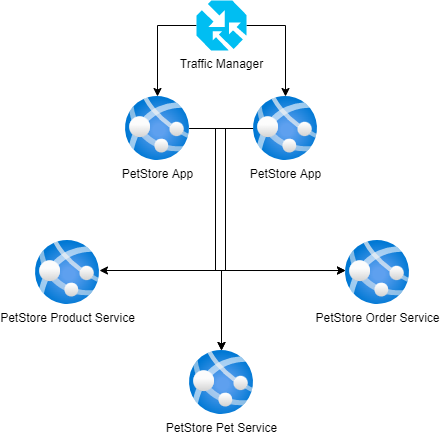

# Module 3: App Service
## Self-study materials
Please, study the following materials:
### Video:

- [Azure Administration: Implement and Manage Application Services](https://www.linkedin.com/learning/azure-administration-implement-and-manage-application-services) (~2 hr 8 min)

### Recommended:
- [Deploy a website to Azure with Azure App Service](https://docs.microsoft.com/en-us/learn/paths/deploy-a-website-with-azure-app-service/)  (~4 hr 3 min)
- [Configure the geographic traffic routing method using Traffic Manager](https://learn.microsoft.com/en-us/azure/traffic-manager/traffic-manager-configure-geographic-routing-method)
- [Overview of PetStore](https://github.com/chtrembl/azure-cloud/tree/main/petstore)  (~1 hr 46 min) (optional)

> ## Useful tips
> As the final task is a compilation of the modules tasks and one of the completion criteria is to provide a GIT repository, would be helpful to clone the basic project to your own code repository before the current home task and commit all changes there.
In order to avoid unpredictable money spending, please, use a minimal tier for the resources as possible.

## Home task
Please, complete the following task:

- PetStore is a web application that contains:
  * Web application: *petstoreapp*
  * API services: *petstorepetservice*, *petstoreproductservice*, *petstoreorderservice*
- These services need to be deployed to respective Azure App Services using Docker deployment.
- Web App Service configuration needs to be updated to point to API services URL.
- API Services should be configured to Rule based auto-scale based on CPU load increase (requires App Service Plan >= Standard S1).
- Web project deployment should be available using deployment slots (requires App Service Plan >= Standard S1).

[PetStore source code](https://git.epam.com/anton_lytunenko/cloudx-java-azure-dev/-/tree/main).

### Definition of done:

- 2 Web Apps in different regions, and API Services are deployed as Azure App Services
- Web application works and able to sign in using Azure App service URL
- API Services are configured for auto-scaling and tested (e.g [k6](https://k6.io/) tool) to generate the load that scaling works
- Web App Service should be using deployment slots (one Web App Service with deployment slots is enough)
- Traffic Manager is configured to point to 2 Web App Services in different regoins and UI should be able to open via traffic manager URL

## Clean up:
Resources left running can cost you money. You can delete resources individually or delete the resource group to delete the entire set of resources.
### Definition of done:
- Resources are deleted

