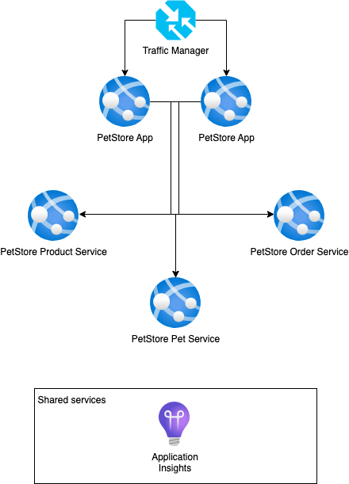

# Module 4: Monitoring and logging
## Self-study materials

### Intro
[Azure Monitor](https://docs.microsoft.com/en-us/azure/azure-monitor/overview) maximizes the availability and performance of your applications and services by delivering a comprehensive solution for collecting, analyzing, and acting on telemetry from your cloud and on-premises environments. It helps you understand how your applications are performing and proactively identifies issues affecting them and the resources they depend on.

*Please, study the following materials:*
### Video:

- [Azure Application Insights Tutorial | Amazing telemetry service](https://www.youtube.com/watch?v=A0jAeGf2zUQ&ab_channel=AdamMarczak-AzureforEveryone) (~34 min 25s)

### Documents:
- [Azure Application Insights Tutorial | Amazing telemetry service](https://docs.microsoft.com/en-us/learn/modules/analyze-infrastructure-with-azure-monitor-logs) (~36 min)
- [Diagnose startup errors in your application using Kudu console](https://docs.microsoft.com/en-us/learn/modules/azure-diagnose-application-startup-errors-with-kudu-console) (~37 min)
- [Application Insights for Spring Boot applications](https://learn.microsoft.com/en-us/azure/azure-monitor/app/java-spring-boot) (~16 min)
- [Log Analytics tutorial](https://docs.microsoft.com/en-us/azure/azure-monitor/logs/log-analytics-tutorial) (~6 min)
- [Metrics tutorial](https://docs.microsoft.com/en-us/azure/azure-monitor/essentials/metrics-getting-started) (~3 min)
### Recommended:
- [Azure Apps Diagnostics Instrumentation and Logging](https://www.linkedin.com/learning/azure-apps-diagnostics-instrumentation-and-logging) (~1 hr 14 min)
- [Quickstart: Start monitoring your app with Azure Monitor Application Insights](https://learn.microsoft.com/en-us/azure/azure-monitor/app/java-in-process-agent) (~5 min)
- [Azure Monitor Workbooks](https://learn.microsoft.com/en-us/azure/azure-monitor/visualize/workbooks-overview) (~6 min)
- [Monitor your Azure services in Grafana](https://learn.microsoft.com/en-us/azure/azure-monitor/visualize/grafana-plugin) (~6 min)

## Home task
*Please, complete the following task:*

**Add Application Insights Logging and Check Metrics.**

1. Clone and deploy [PetStore source code](https://git.epam.com/anton_lytunenko/cloudx-java-azure-dev/-/tree/main) to Azure App Service
2. Create Application Insights service instance 
3. Enable Application Insights connection for PetStore services using Spring Boot starter and deploy services
4. Browse Pet Store website by adding several products to shopping cart and check the following in Application Insights:
   1. Overview tab for incoming requests and failures
   2. Live metrics
   3. Transaction search
   4. Performance
5. Make several changes in services:
   1. Add custom metric to PetStoreServiceImpl.getProducts (using TelemetryClient) to store information who is asking (username and session) products
   2. Add logging to PetStoreServiceImpl.getProducts for the number of items that were returned to user.
   3. Deploy services to Azure App Services
6. Check logs and custom events. 
7. Use Kusto query to filter all logs by current session id (it can be found at bottom left corner on home page).
8. Break the PetStoreServiceImpl.getProducts by adding `throw new Exception("Cannot move further");`. Redeploy service. Check the logs in Application Insights
9. Use Kusto query number of exceptions with text `Cannot move further` for last hour
10. Evaluate the error through Failures Tab in Application Insights to get the stacktrace

**Definition of done:**

1. You have checked that Information Logs written from PetStore services in Application Insights
2. You have found the error logs using “Failures” tab in Application Insights
3. You have checked the metrics updated to App Service on Metrics tab 

## Clean up:
Resources left running can cost you money. You can delete resources individually or delete the resource group to delete the entire set of resources.
### Definition of done:
- Resources are deleted

