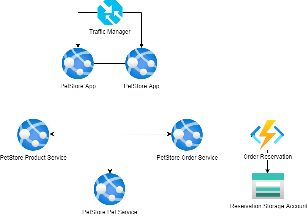

# Module 5: Functions and storage
## Self-study materials

*Please, study the following materials:*
### Documents:
*Functions*
- [Choose the best Azure service to automate your business processes](https://www.youtube.com/watch?v=A0jAeGf2zUQ&ab_channel=AdamMarczak-AzureforEveryone) (~44 min)
- [Create serverless logic with Azure Functions](https://www.youtube.com/watch?v=A0jAeGf2zUQ&ab_channel=AdamMarczak-AzureforEveryone) (~36 min)
- [Develop Java serverless Functions on Azure using Maven](https://learn.microsoft.com/en-us/training/modules/develop-azure-functions-app-with-maven-plugin/) (~44 min)
- [Spring Cloud Function in Azure](https://learn.microsoft.com/en-us/azure/developer/java/spring-framework/getting-started-with-spring-cloud-function-in-azure) (~8 min)

*Storages*
- [Explore Azure Storage services](https://learn.microsoft.com/en-us/training/modules/azure-storage-fundamentals/) (~27 min)
- [Store application data with Azure Blob storage](https://learn.microsoft.com/en-us/training/modules/store-app-data-with-azure-blob-storage/) (~50 min)
- [Upload a file to an Azure Storage Blob](https://learn.microsoft.com/en-us/azure/developer/java/spring-framework/configure-spring-boot-starter-java-app-with-azure-storage) (~5 min)

### Recommended:
- [Execute an Azure Function with triggers](https://docs.microsoft.com/en-us/learn/modules/execute-azure-function-with-triggers/) (~1 hr 23 min)
- [Expose multiple Azure Function apps as a consistent API by using Azure API Management](https://docs.microsoft.com/en-us/learn/modules/build-serverless-api-with-functions-api-management/) (~41 min)
- [Enable automatic updates in a web application using Azure Functions and SignalR Service](https://docs.microsoft.com/en-us/learn/modules/automatic-update-of-a-webapp-using-azure-functions-and-signalr/) (~ 55 min)
- [Create a long-running serverless workflow with Durable Functions](https://docs.microsoft.com/en-us/learn/modules/create-long-running-serverless-workflow-with-durable-functions/) (~46 min)
- [Chain Azure Functions together using input and output bindings](https://docs.microsoft.com/en-us/learn/modules/chain-azure-functions-data-using-bindings/) (~1 hr 10 min)
- [Make your application storage highly available with read-access geo-redundant storage](https://docs.microsoft.com/en-us/learn/modules/ha-application-storage-with-grs/) (~34 min)
- [Copy and move blobs from one container or storage account to another from the command line and in code](https://docs.microsoft.com/en-us/learn/modules/copy-blobs-from-command-line-and-code/) (~58 min)
- [Optimize storage performance and costs using Blob storage tiers](https://docs.microsoft.com/en-us/learn/modules/optimize-archive-costs-blob-storage/) (~43 min)
- [Secure your Azure Storage account](https://docs.microsoft.com/en-us/learn/modules/secure-azure-storage-account/) (~45 min)
- [Choose a data storage approach in Azure](https://docs.microsoft.com/en-us/learn/modules/choose-storage-approach-in-azure/) (~30 min)

*When you finish, please change the assignment status from "Planned" to "Done"*

## Home task
*Please, complete the following task:*

You have PetStore application which allows the customers to add products to shopping cart, which means order initiation. 
But for now, you don't have any system to send the requests to the warehouse in order to reserve the selected items.
As a key developer, you should add a new service called OrderItemsReserver (as Azure Function) that generates an order request and upload it to Blob Storage. 
Communication between PetStore application and the new service should be implemented in the simplest way: HTTP call.

### A solution should cover the next requirements:

Each time when customer (same session) update shopping cart, order request file has to be uploaded to storage with order details and product list (file should be overwritten for user session).

**Definition of done:**

1. PetStore Web project is modified and deployed to the Azure App Service
2. OrderItemsReserver service is developed and deployed as the Azure Function
3. Each time when customer (same session) update shopping cart, the new JSON file with the order details appears in Blob Storage

## Clean up:
Resources left running can cost you money. You can delete resources individually or delete the resource group to delete the entire set of resources.
### Definition of done:
- Resources are deleted

