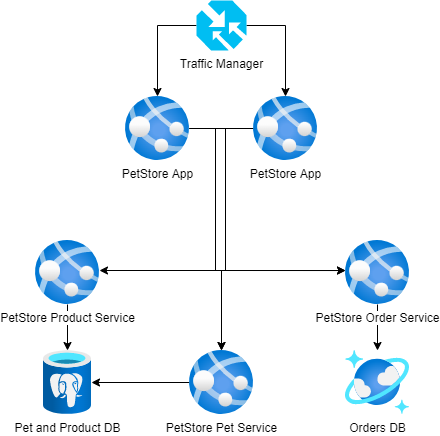

# Module 6: Databases. PostgreSQL. CosmosDB
## Self-study materials

*Please, study the following materials:*

### Documents:

- [Choose a data storage approach in Azure](https://docs.microsoft.com/en-us/learn/modules/choose-storage-approach-in-azure/) (~30 min)
- [Azure Database for PostgreSQL](https://learn.microsoft.com/en-us/training/paths/introduction-to-azure-postgres/) (~37 min)
- [Use Spring Data JPA with Azure Database for PostgreSQL](https://learn.microsoft.com/en-us/azure/developer/java/spring-framework/configure-spring-data-jpa-with-azure-postgresql?toc=%2Fazure%2Fpostgresql%2Ftoc.json&bc=%2Fazure%2Fbread%2Ftoc.json&tabs=passwordless) (~60 min)
- [Explore Azure Cosmos DB](https://learn.microsoft.com/en-us/training/modules/explore-azure-cosmos-db/) (~40 min)
- [Implement partitioning in Azure Cosmos DB](https://learn.microsoft.com/en-us/training/modules/implement-partitioning-azure-cosmos-db/) (~20 min)
- [Work with Azure Cosmos DB](https://learn.microsoft.com/en-us/training/modules/work-with-cosmos-db/) (~35 min) 
### Recommended:
#### Azure Database for PostgreSQL
- [Work with Azure Database for PostgreSQL](https://learn.microsoft.com/en-us/training/paths/microsoft-learn-azure-database-for-postgresql/) (~2 hr)
- [How to backup and restore a server in Azure Database for PostgreSQL - Single Server using the Azure portal](https://learn.microsoft.com/en-us/azure/postgresql/single-server/how-to-restore-server-portal) (~1 hr)
#### Cosmos DB
- [Use the Azure Cosmos DB for NoSQL SDK](https://learn.microsoft.com/en-us/training/modules/use-azure-cosmos-db-sql-api-sdk/) (~45 min)
- [Configure the Azure Cosmos DB for NoSQL SDK](https://learn.microsoft.com/en-us/training/modules/configure-azure-cosmos-db-sql-api-sdk/) (~44 min)
- [Configure replication and manage failovers in Azure Cosmos DB](https://learn.microsoft.com/en-us/training/modules/configure-replication-manage-failovers-azure-cosmos-db/) (~39 min) 

*When you finish, please change the assignment status from "Planned" to "Done"*

## Home task
*Please, complete the following task:*

**Task 1: Use Azure database for PostgreSQL**

Sample PetStore Pet and Product Services use the in-memory product and pet information storage. Create Azure Database for PostgreSQL instance and use it instead of the in-memory DB.

Definition of done

1. PetStore project is deployed to the Azure App Service
2. Azure Database for PostgreSQL instance is created
3. Tables are created
4. PetStore Pet and Product Services work properly with Azure Database for PostgreSQL

**Task 2: Use Cosmos DB**

You have PetStore application which allows the customers to make the orders. The Order Service uses in-memory JSON-based cache to store information about orders.
You should implement Order storage using CosmosDB.

Definition of done:

1. PetStore Order Service project is modified and deployed to the Azure App Service
2. The database is chosen and created
3. After the customer creates an order, the new record appears in the CosmosDB Database. 

## Clean up:
Resources left running can cost you money. You can delete resources individually or delete the resource group to delete the entire set of resources.
### Definition of done:
- Resources are deleted

