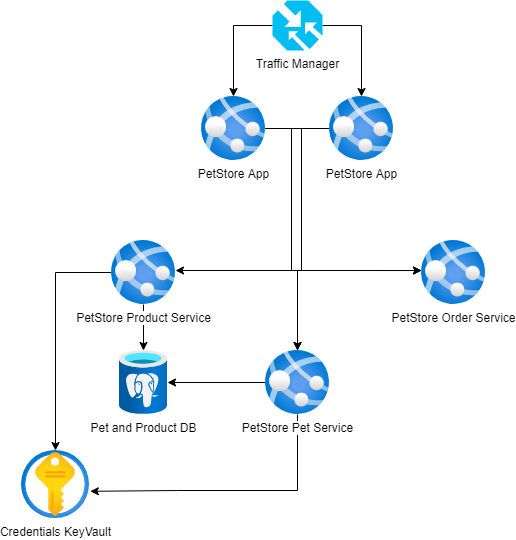

# Module 7: Key Vault
## Self-study materials

*Please, study the following materials:*

### Documents:

- [What are managed identities for Azure resources?](https://docs.microsoft.com/en-us/azure/active-directory/managed-identities-azure-resources/overview) (~20 min)
- [Manage secrets in your server apps with Azure Key Vault](https://docs.microsoft.com/en-us/learn/modules/manage-secrets-with-azure-key-vault/) (~50 min)
- [Set and retrieve a secret from Azure Key Vault using Azure CLI](https://docs.microsoft.com/en-us/azure/key-vault/secrets/quick-create-cli) (~10 min)
- [Use Key Vault references for App Service and Azure Functions](https://docs.microsoft.com/en-us/azure/app-service/app-service-key-vault-references) (~20 min)

### Recommended:
- [Azure Key Vault basic concepts](https://docs.microsoft.com/en-us/azure/key-vault/general/basic-concepts)

## Home task
*Please, complete the following task:*

In this section, you practice how to work with secrets from Azure Key Vault in your App Service or Azure Functions application without requiring any code changes.
Azure Key Vault is a service that provides centralized secrets management, with full control over access policies and audit history.

Based on the solution from the Databases module (Task 1), you must store DB connection as a secret in a Key Vault Instance and reference it in the app using a unique secret URI. You need to create a Key Vault with the database connection string stored as a secret and reference it as App service settings using key vault reference syntax.

Definition of done:

1. Key vault created with a secret value assigned to the connection string
2. Managed identity enabled for the App Service
3. Created Key Vault access policy with correct permissions for the app service managed identity
4. Added new setting to the App service Application settings referencing Key Vault secret by unique URL.
5. App service uses the configuration setting that points to the Key vault secret  

## Clean up:
Resources left running can cost you money. You can delete resources individually or delete the resource group to delete the entire set of resources.
### Definition of done:
- Resources are deleted

