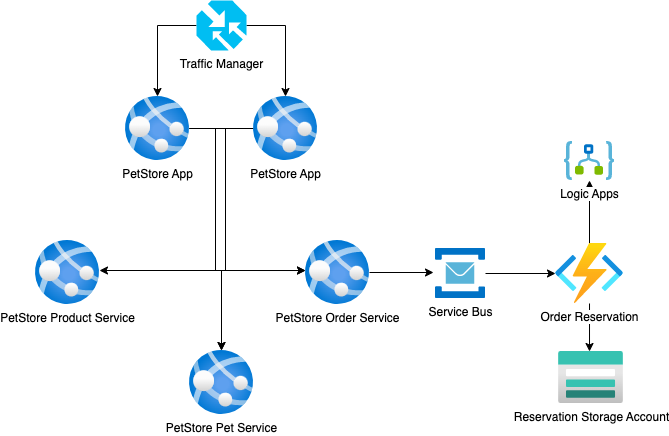

# Module 8: Service Bus, Event Hub, Event Grid
## Self-study materials

*Please, study the following materials:*
### Documents:
- [Choose a messaging model in Azure to loosely connect your services](https://docs.microsoft.com/en-us/learn/modules/choose-a-messaging-model-in-azure-to-connect-your-services/) (~45 min)
- [Implement message-based communication workflows with Azure Service Bus](https://docs.microsoft.com/en-us/learn/modules/implement-message-workflows-with-service-bus/) (~54 min)
- [Enable reliable messaging for Big Data applications using Azure Event Hubs](https://docs.microsoft.com/en-us/learn/modules/enable-reliable-messaging-for-big-data-apps-using-event-hubs/) (~56 min)
- [React to state changes in your Azure services by using Event Grid](https://docs.microsoft.com/en-us/learn/modules/react-to-state-changes-using-event-grid/) (~33 min)

### Video:
- [Azure Service Bus](https://www.linkedin.com/learning/azure-service-bus) (~46 min)
- [Azure Event Grid](https://www.linkedin.com/learning/azure-event-grid) (~38 min)

### Recommended:
- [Azure Functions reliable event processing](https://docs.microsoft.com/en-us/azure/azure-functions/functions-reliable-event-processing) (~6 min)
- [Monitor GitHub events by using a webhook with Azure Functions](https://docs.microsoft.com/en-us/learn/modules/monitor-github-events-with-a-function-triggered-by-a-webhook/) (~53 min)

*When you finish, please change the assignment status from "Planned" to "Done"*

## Home task
*Please, complete the following task:*

You have PetStore application which allows the customers to add products to shopping cart, which means order initiation. 
But for now, you don't have any system to send the requests to the warehouse in order to reserve the selected items.
As a key developer, you should add a new service called OrderItemsReserver (as Azure Function) that generates an order request and upload it to Blob Storage. In addition, you need to implement a communication between eShopOnWeb application and the new service, consequently, you should investigate and choose the best technology (Service Bus, Event Hub or Event Grid) to implement it.

A solution should cover the next requirements:

- uploaded order request is a JSON file with the order details (item Id, quantity)
- uploading to Blob Storage must support a retry policy, in case an unsuccessful attempt, the code will try to upload the file up to 3 times 
- the fallback scenario should be implemented, for instance, in case the file can’t be created (the service is unavailable, an exception during processing, etc.), you should receive an email with the order details (tip: Logic Apps can be used for this scenario)

### A solution should cover the next requirements:

Each time when customer (same session) update shopping cart, order request file has to be uploaded to storage with order details and product list (file should be overwritten for user session).

**Definition of done:**

1. PetStore Web project is modified and deployed to the Azure App Service 
2. OrderItemsReserver service is developed and deployed as the Azure Function 
3. Communication service (Service Bus or Event Hub or Event Grid) is created and configured 
4. Each time when customer (same session) update shopping cart, the new JSON file with the order details appears in Blob Storage 
5. In case a Blob Storage connection string is incorrect, after the customer creates an order, the new JSON file with the order details doesn’t appear in Blob Storage, and instead of the new file you receive an email

## Clean up:
Resources left running can cost you money. You can delete resources individually or delete the resource group to delete the entire set of resources.
### Definition of done:
- Resources are deleted

