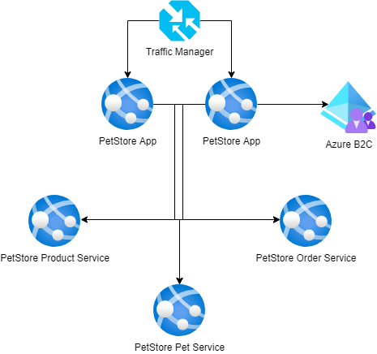

# Module 9: Authentication
## Self-study materials

*Please, study the following materials:*
### Video:
- [Microsoft Azure: Active Directory](https://www.linkedin.com/learning/microsoft-azure-active-directory-7/dive-into-azure-active-directory-ad) (~1 hr 47 min)
### Documents:
- [What is Azure Active Directory authentication?](https://docs.microsoft.com/en-us/azure/active-directory/authentication/overview-authent) (~4 min)
- [Secure your application by using OpenID Connect and Azure AD](https://docs.microsoft.com/en-us/learn/modules/secure-app-with-oidc-and-azure-ad/) (~50 min)
- [Create a new tenant in Azure Active Directory](https://docs.microsoft.com/en-us/azure/active-directory/fundamentals/active-directory-access-create-new-tenant) (~2 min)
- [Add an application to your Azure Active Directory (Azure AD) tenant](https://docs.microsoft.com/en-us/azure/active-directory/manage-apps/add-application-portal) (~3 min)
- [What is guest user access in Azure Active Directory B2B?](https://docs.microsoft.com/en-us/azure/active-directory/external-identities/what-is-b2b) (~3 min)
- [Configure your App Service or Azure Functions app to use Azure AD login](https://docs.microsoft.com/en-gb/azure/app-service/configure-authentication-provider-aad) (~10 min)
- [Authenticate and authorize users end-to-end in Azure App Service](https://docs.microsoft.com/en-gb/azure/app-service/tutorial-auth-aad?pivots=platform-windows) (~15 min)
- [Add sign-in with Azure Active Directory B2C to a Spring web app](https://learn.microsoft.com/en-us/azure/developer/java/spring-framework/configure-spring-boot-starter-java-app-with-azure-active-directory-b2c-oidc) (~20 min)

### Recommended:
- [What is Azure Active Directory?](https://docs.microsoft.com/en-us/azure/active-directory/fundamentals/active-directory-whatis) (~9 min)
- [Secure Azure Active Directory users with Multi-Factor Authentication](https://docs.microsoft.com/en-us/learn/modules/secure-aad-users-with-mfa/) (~38 min)

*When you finish, please change the assignment status from "Planned" to "Done"*

## Home task
*Please, complete the following task:*

Configure PetStore App to use Azure B2C for user authentication.

### Definition of done:

1. Azure B2C identity provider has been configured
2. PetStore App has been registered as an Application in Azure B2C
3. PetStore App Application has been configured with User Flows
4. PetStore App Service configuration has been configured to use Azure B2C
5. PetStore App user can login via Azure B2C

## Clean up:
Resources left running can cost you money. You can delete resources individually or delete the resource group to delete the entire set of resources.
### Definition of done:
- Resources are deleted

